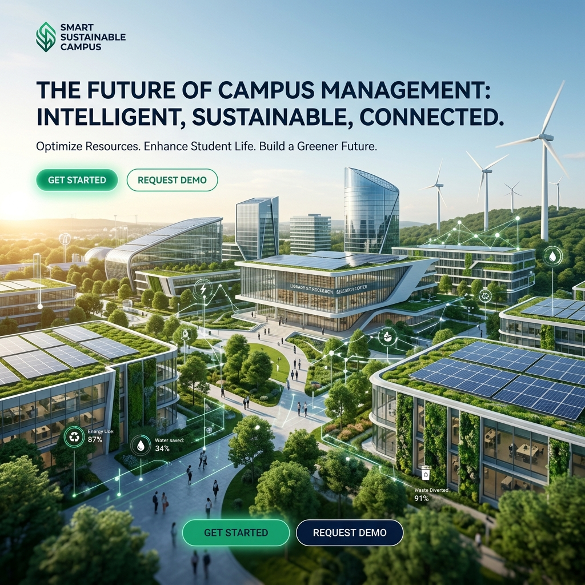
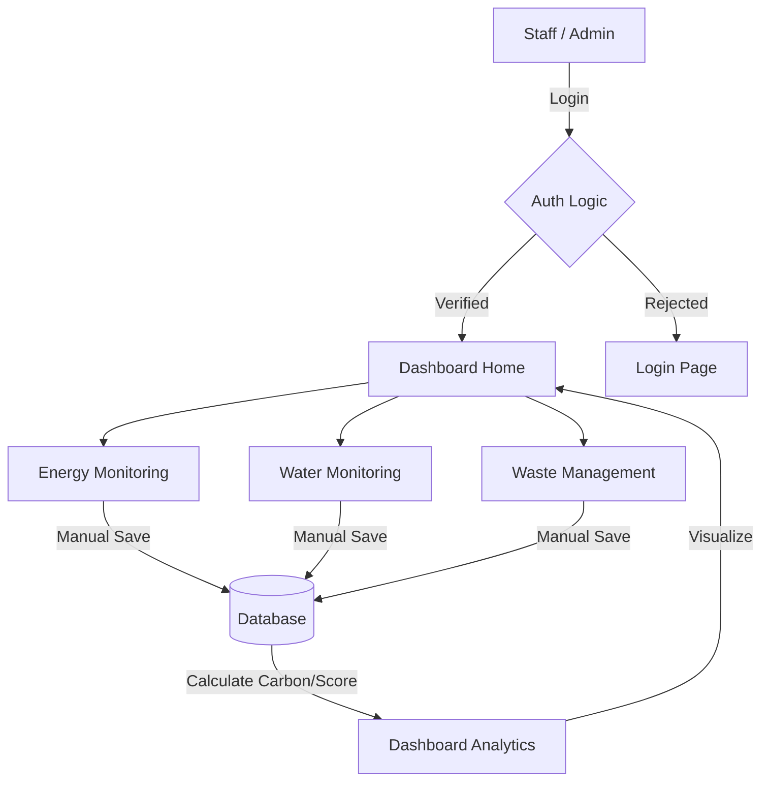
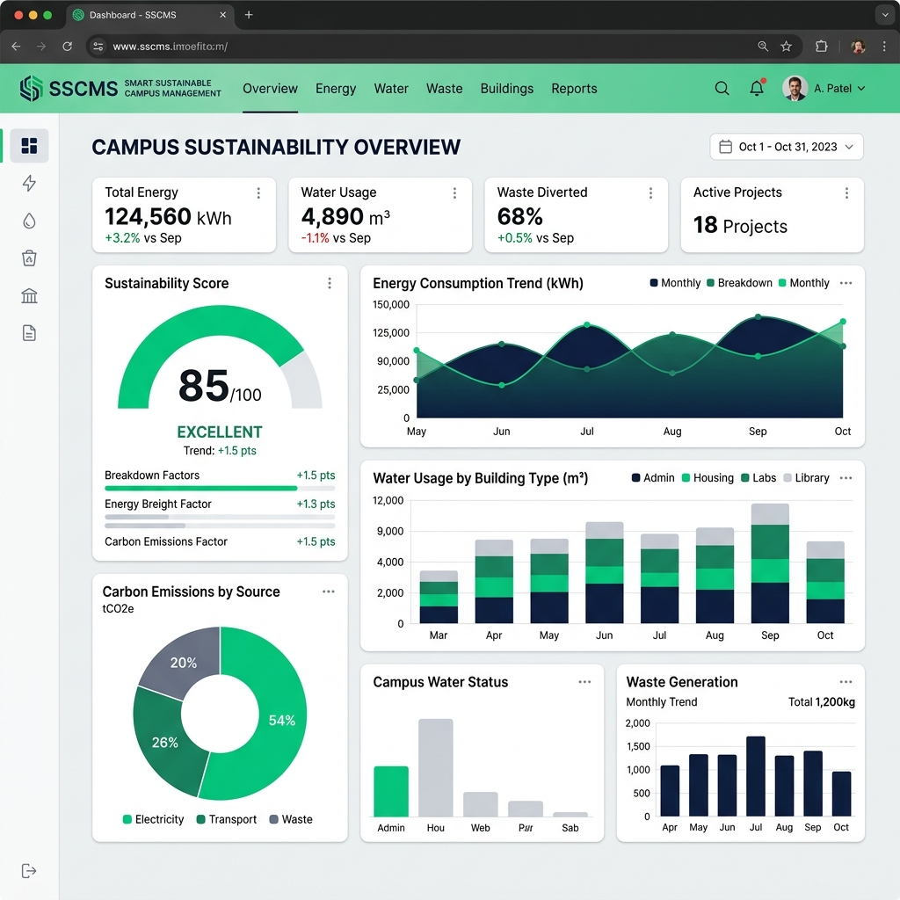
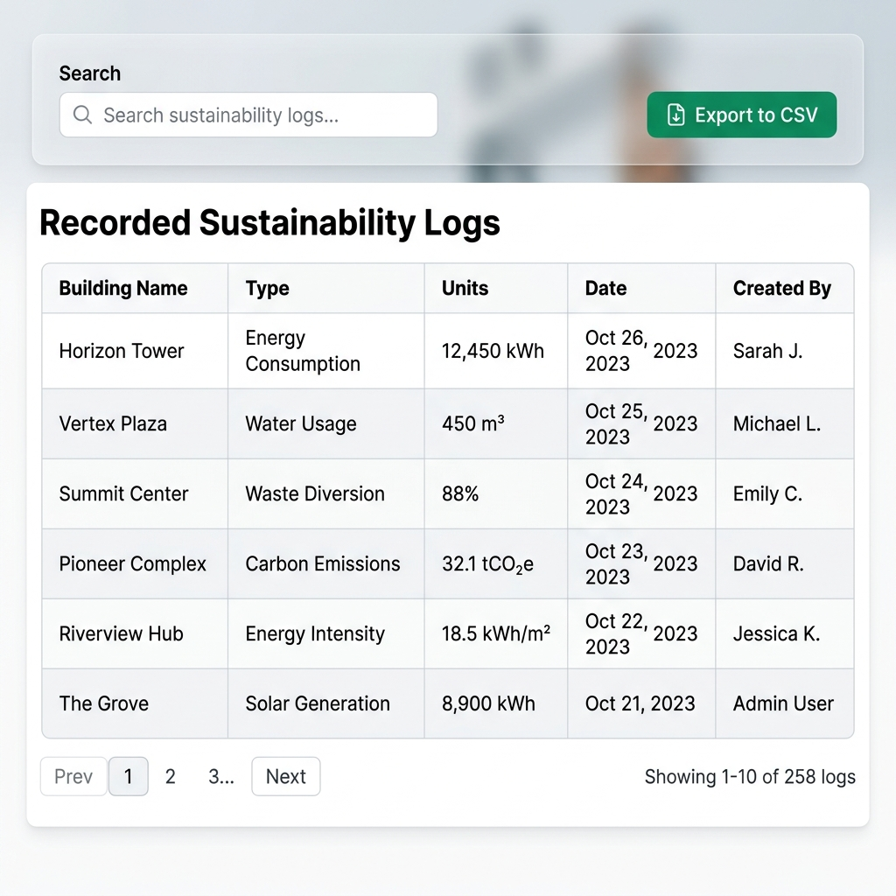
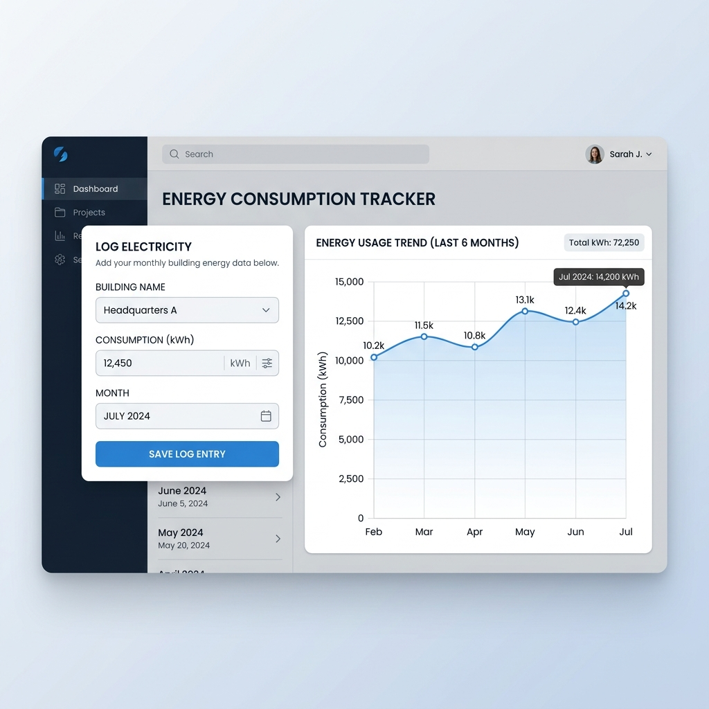
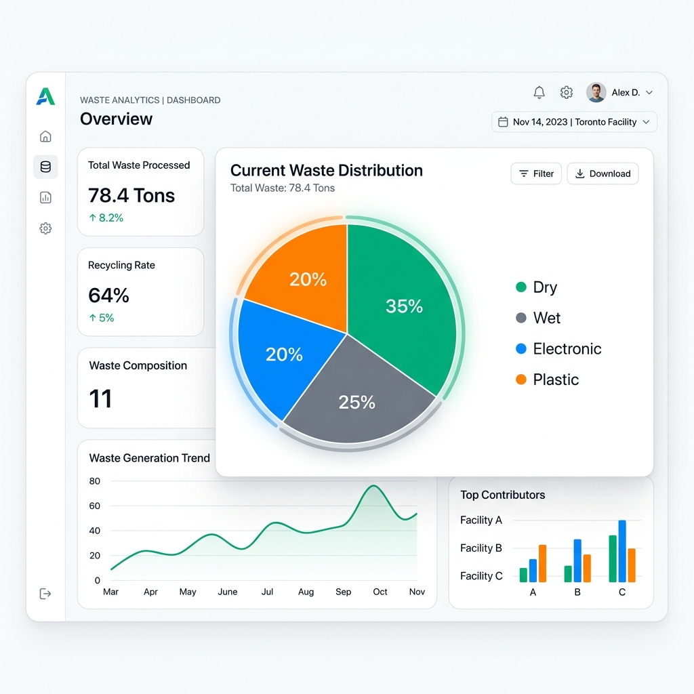

# Smart Sustainable Campus Management System (SSC-MS)



[](https://www.python.org/)
[](https://www.djangoproject.com/)
[](https://opensource.org/licenses/MIT)
[](https://sdgs.un.org/goals)

## 🎯 Project Overview

The **Smart Sustainable Campus Management System (SSC-MS)** is a comprehensive digital platform designed to address environmental challenges in modern educational institutions. This system allows administrators to track, manage, and analyze critical sustainability metrics—including energy consumption, water usage, and waste generation—transforming raw data into actionable insights through dynamic visualizations and automated sustainability scoring.

---

## 🚀 Key Features

- **📊 Dynamic Dashboard:** Real-time visualization of campus resource usage with interactive charts and metrics.
- **⚡ Automated Carbon Tracking:** Instant calculation of carbon emissions based on energy consumption logs.
- **♻️ Waste Management:** Categorized tracking of dry, wet, electronic, and plastic waste levels.
- **🛡️ Multi-Role Security:** Advanced Role-Based Access Control (RBAC) ensuring data integrity between ADMIN and STAFF.
- **📈 Sustainability Analytics:** A dynamic "Campus Health" score (0-100) that motivates eco-conscious habits.
- **📄 CSV Data Export:** One-click downloads for recorded logs, ready for detailed evaluation in Excel.

---

## 🌍 SDG Alignment

This project is built to support the United Nations **Sustainable Development Goals (SDGs)**:

- **SDG 6:** Clean Water and Sanitation (Monitoring consumption & leak detection)
- **SDG 7:** Affordable and Clean Energy (Tracking high-usage areas)
- **SDG 11:** Sustainable Cities and Communities (Improving institutional infrastructure)
- **SDG 12:** Responsible Consumption and Production (Categorized waste management)
- **SDG 13:** Climate Action (Automated carbon footprint measurement)

---

## 🛠️ Tech Stack

- **Backend:** Python, Django, Django REST Framework
- **Authentication:** JWT (JSON Web Tokens) with SimpleJWT
- **Database:** SQLite (Lightweight / Portable)
- **Frontend:** Vanilla CSS, Bootstrap 5, Chart.js
- **Architecture:** Decoupled Three-Tier Architecture

---

## ⚙️ System Flow



---

## 🏁 Setup Instructions

### 1. Prerequisite Checks
Ensure Python 3.10+ is installed on your local machine.

### 2. Fork & Clone
```bash
git clone https://github.com/harshalahire07/Smart-Sustainable-Campus-Management-System-SSC-MS-.git
cd ES_Project
```

### 3. Initialize Environment
```bash
# Windows
python -m venv venv
.\venv\Scripts\activate

# Linux / Mac
python3 -m venv venv
source venv/bin/activate
```

### 4. Install Dependencies
```bash
pip install -r requirements.txt
```

### 5. Migration & First User
```bash
python manage.py makemigrations
python manage.py migrate
python manage.py createsuperuser
```

### 6. Launch Application
```bash
python manage.py runserver
```
Visit `http://127.0.0.1:8000/`

---

## 🧑‍💻 Demo Credentials

| Role | Username | Password | Access Level |
| :--- | :--- | :--- | :--- |
| **Admin** | `admin` | `password123` | Full control: delete logs, add staff |
| **Staff** | `staff` | `password123` | Log data, view analytics. No delete/user management. |

---

## 📸 Screenshots Section

| Dashboard Home | Sustainability Records |
| :---: | :---: |
|  |  |

| Energy Tracking | waste Analytics |
| :---: | :---: |
|  |  |

---

## 📝 License

Distributed under the **MIT License**. See `LICENSE` for more information.

---

## 📞 Contact

**Harshal Ahire**  
GitHub: [@harshalahire07](https://github.com/harshalahire07)  
Project Link: [SSC-MS](https://github.com/harshalahire07/Smart-Sustainable-Campus-Management-System-SSC-MS-)
